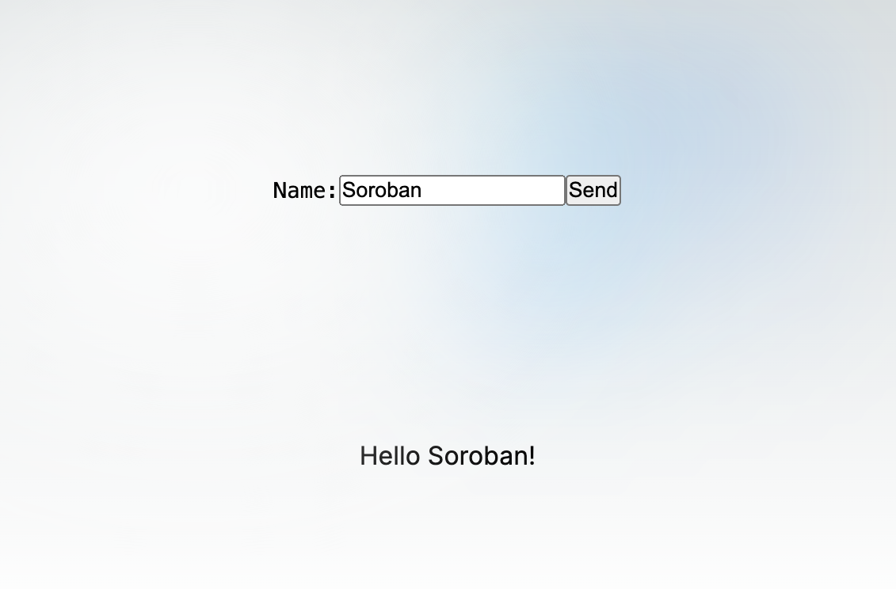

# Soroban smart contracts in Next.js

Soroban enables developers to build smart contracts on the Stellar blockchain, and incorporate the advanced assets and payment features of Stellar, in their own dApps. This tutorial shows how to invoke smart contracts from a simple web application, built with Next.js.

## Deploy Hello World smart contract
The default Hello World described in the documentation is used in this tutorial, without any modifications. All needed to setup and test bindings is a smart contract that can accept a text string and respond with a value. It’s less important what the smart contract actually does. For full installation guide see [Setup](https://developers.stellar.org/docs/build/smart-contracts/getting-started/setup) or skip to the [Hello World](https://developers.stellar.org/docs/build/smart-contracts/getting-started/hello-world) section if the Stellar CLI is already installed. Note: The contract ID will be needed in the next step.

## TypeScript bindings
The Stellar CLI can generate bindings for different programming languages (see [documentation](https://developers.stellar.org/docs/tools/developer-tools/cli/stellar-cli#stellar-contract-bindings)), so there’s no need for writing code to communicate directly with the smart contract through RPC. The Stellar CLI will create a TypeScript package, easy to implement in a TypeScript project. In a terminal, run this command:

```bash
stellar contract bindings typescript \
  --network testnet \
  --contract-id <your-contract-id> \
  --output-dir package/hello_world
```

## Install Next.js
This tutorial assumes that Node is installed, if that’s not the case, the Next.js [documentation](https://nextjs.org/docs/getting-started/installation) has a section about requirements. To create a Next.js project run this command in a terminal:

```bash
npx create-next-app@latest 
```

## Add binding package
The binding package can now be copied into the Next.js project. Copy package/hello_world (both folder and subfolder including all files) to the root of the Next.js project. 

The package has to be linked to the project, since it’s a local package, and not installed from the public npm registry. Linking the package is a two-step process. First a symlink in the global package folder is created. The next step is to create a symlink from the global package to the Next.js project’s node_moduls folder. 

These commands will created the two-way link:

```bash
cd package/hello_world
npm run build
npm link

cd ../..
npm link hello_world
```

The package is now ready to be used like any other package installed from the public npm registry. Note the package has to be built before linking.

## Build the application
Instead of building a Next.js project from scratch, the default application installed with Next.js is used, and then modified to fit the needs for this application. The default Next.js page has a lot of information, links, images etc. and all of that can be removed, so only the most essential code is left. The `src/app/page.tsx` file should look like this after removing the default content:

```js
import styles from "./page.module.css"; 

export default function Home() { 
   return ( 
      <main className={styles.main}> 
         <div className={styles.center}> 
            <div className={styles.description}> 

            </div> 
         </div>
      </main> 
   ); 
}
```

### Add Smart Contract Binding
Since the smart contract binding is already linked, it can be imported in the TypeScript code as any other installed packages. Access to the smart contract goes through a client, which needs information about the network and RPC url. The network and url must be the same as used for generating the binding:

```js
import * as Client from "hello_world";

const contract = new Client.Client({ 
   ...Client.networks.testnet, 
   rpcUrl: 'https://soroban-testnet.stellar.org:443' 
});
```

### Add UI controls
The frontend’s functionality has two parts, the first will take text from an input field and send it to the Hello World smart contract, and the second will take the response from the smart contract and display it. 

All that's needed is a form with an text input field and a submit button. The form submits the form data to the function `formSubmit()` when the user clicks the Send button. The form data (the name) is sent to the `hello` smart contract function, and the response it stored as a message state, and displayed on the UI. 

This is the complete code used for the `src/app/page.tsx` file:

```js
"use client"; 
import { useState } from "react"; 
import * as Client from "hello_world"; 
import styles from "./page.module.css"; 

const contract = new Client.Client({ 
   ...Client.networks.testnet, 
   rpcUrl: 'https://soroban-testnet.stellar.org:443' 
}); 

export default function Home() { 
   const [msg, setMsg] = useState(""); 

   const formSubmit = async (formData: FormData) => { 
      let name = formData.get('name') as string; 

      if (name) { 
         const { result } = await contract.hello({ to: name }); 
         setMsg(result.join(" ") + "!"); 
      } 
   } 

   return ( 
      <main className={styles.main}> 
         <div className={styles.center}> 
            <div className={styles.description}> 
               <form action={formSubmit}> 
                  <label>Name: </label> 
                  <input name="name" /> 
                  <button type="submit">Send</button> 
               </form> 
            </div> 
         </div> 
         {msg} 
      </main> 
   ); 
}
```

### Run the application
To see the result in a browser, use the npm commands previously used for testing the Next.js installation:

```bash
npm run build
npm run start
```

Navigate to `http://localhost:3000` in a browser to see the web application.

## Conclusion
This quick run-through shows how to use bindings, to interact with a smart contract from a Nexj.js application, for a very simple use case. Read more about Soroban smart contracts and bindings in the documentation:

- [Soroban Smart Contracts Documentation](https://developers.stellar.org/docs/build/smart-contracts)
- [Soroban Smart Contracts Bindings](https://developers.stellar.org/docs/tools/developer-tools/cli/stellar-cli#stellar-contract-bindings)

